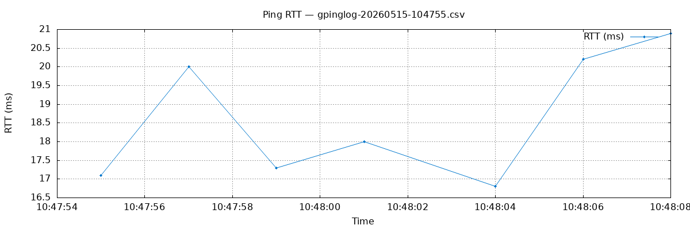

<div align="center">

# **GSH**

*Gin Shell — A collection of bash scripts*

<p>
  <a href="#"></a>
</p>

</div>

---

## **Contact**

* **Email:** [augustodamasceno@protonmail.com](mailto:augustodamasceno@protonmail.com)

---

## **License**

This project is licensed under the GNU General Public License v3.0.

<small>Copyright &copy; 2015-2026, Augusto Damasceno. All rights reserved.</small>

---

## How it works  
All scripts are added in the folder .gsh in the home directory, and this directory is  
appended in the PATH variable (in the bash and zsh rcfiles).

## Scripts

**File & Directory Management**
- `gbulkcp` — Copies files listed in a file, preserving relative paths, from source to destination
- `gmv` — Batch-renames files matching two patterns by substituting a character
- `grsync` — Rsyncs source to destination with checksum comparison and a progress bar
- `gtxt-selection` — Extracts lines from a file between a start and stop delimiter string

**System Monitoring & Info**
- `gdisk` — Shows disk and inode usage for all mounts and per-subdirectory breakdown
- `gmonitor` — Continuously prints system stats at a configurable interval
- `gsysinfos` — Prints detailed system info for engineering, low-latency and hardware development
- `gtop` — Displays the top 3 processes by CPU and top 3 by memory usage

**Process Management**
- `gikill` — Interactively selects and kills a process by name from a numbered list
- `gkill` — Kills all processes whose name matches the given string

**Networking**
- `getip` — Finds the IP address of a LAN host by MAC address using nmap
- `getnames` — Resolves hostnames of all active hosts on a LAN range using nmap
- `gpinglog` — Pings a destination continuously, logging time and response to a timestamped CSV file; stops on Ctrl+C or after an optional duration
- `gwmirror` — Mirrors a website locally using wget

**Security & Cryptography**
- `ghmac` — Derives an HMAC from a password and salt using a specified OpenSSL digest
- `grand` — Generates a random base64 string of a given byte length

**Media & Documents**
- `ggif` — Creates an animated GIF from a filtered set of images using ImageMagick
- `gpdf` — Merges PDFs or converts images to a single PDF in the current directory
- `gqrcode` — Generates a QR code PNG from the contents of a text file
- `gyoutube` — Batch-downloads videos using yt-dlp, reading URLs from a file

**Development & System Setup**
- `genv` — Manages Python virtualenvs in `~/myvenvs`: create, activate, or list
- `gservice` — Creates and enables a systemd service unit for a binary in `/usr/sbin`

## Installation and Update

Clone the repository and run the install script:
```
git clone https://github.com/augustodamasceno/gsh.git
cd gsh
bash install.sh
```

To also install all runtime dependencies:
```
bash install.sh --with-deps
```

Pass `-y` for non-interactive mode (auto-accepts prompts in dependency installation):
```
bash install.sh --with-deps -y
```

Scripts are installed to `~/.gsh`, which is appended to `PATH` in your `~/.bashrc` and/or `~/.zshrc`. Running the script again updates the existing installation.

## Uninstall
```
bash remove.sh
```

Removes `~/.gsh` and cleans up the `PATH` entry from `~/.bashrc` and `~/.zshrc`.


## Script Output Examples

### gpinglog

```
time,ip,size,rtt
10:47:55,172.66.147.243,64,17.1
10:47:57,172.66.147.243,64,20.0
10:47:59,104.20.23.154,64,17.3
10:48:01,172.66.147.243,64,18.0
10:48:04,172.66.147.243,64,16.8
10:48:06,172.66.147.243,64,20.2
10:48:08,172.66.147.243,64,20.9
```



---

### Software Reference

**Shell & System**
* https://www.gnu.org/software/bash/
* https://wiki.archlinux.org/index.php/Bash
* https://www.linux.com/answers/what-purpose-path-variable
* https://systemd.io/

**Networking**
* https://nmap.org/
* https://www.ietf.org/rfc/rfc1035.txt
* https://tools.ietf.org/html/rfc7042
* https://www.gnu.org/software/wget/

**Security & Cryptography**
* https://www.openssl.org/docs/manmaster/man1/openssl.html
* https://gnupg.org/

**File & Sync**
* https://rsync.samba.org/
* https://metacpan.org/dist/File-Rename

**System Monitoring & Hardware**
* https://github.com/sysstat/sysstat
* https://github.com/numactl/numactl
* https://www.nongnu.org/dmidecode/
* https://github.com/pciutils/pciutils
* https://github.com/lsof-org/lsof
* http://www.ivarch.com/programs/pv.shtml

**Media & Documents**
* https://imagemagick.org/index.php
* https://www.pdflabs.com/tools/pdftk-the-pdf-toolkit/
* https://fukuchi.org/works/qrencode/
* https://github.com/yt-dlp/yt-dlp

**Development**
* https://docs.python.org/3/library/venv.html

**Text Processing**
* Aho, A., Kernighan, B. and Weinberger, P. (2023). The Awk Programming Language. Addison-Wesley Professional
* https://www.gnu.org/software/gawk/manual/gawk.html
